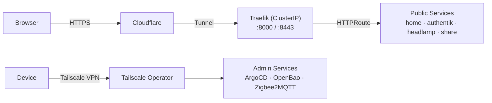
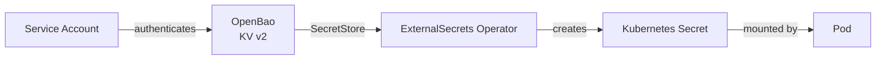

# homelab-gitops

Kubernetes homelab managed declaratively with ArgoCD using the app-of-apps pattern.

> Cluster provisioning (OS, kubeadm, node configuration, openbao provisionning) lives in [homelab-provisioning](https://github.com/issamsisbane/homelab-provisionning).

## Stack

| Layer | Technology |
|---|---|
| GitOps | ArgoCD |
| Ingress | Traefik + Kubernetes Gateway API |
| External access | Cloudflare Tunnel |
| Private access | Tailscale |
| Auth (SSO) | Authentik (OIDC) |
| Secrets | OpenBao + ExternalSecrets |
| Block storage | Longhorn |
| Object storage | SeaweedFS (S3-compatible) |
| Databases | CloudNative PG (PostgreSQL operator) |
| Observability | Prometheus · Loki · Grafana · Alloy |

## Repository Layout

```
bootstrap/   # ArgoCD AppProjects and root app-of-apps (apply once to seed the cluster)
infra/       # Infrastructure components
apps/        # User applications
```

Each component follows a two-file convention:

- **`app-of-apps.yaml`** — ArgoCD Application that recursively syncs everything in its directory
- **`application.yaml`** — The actual ArgoCD Application pointing to a Helm chart with values

ArgoCD watches `main` and reconciles continuously. Infra deletions are intentionally manual (prune disabled); app deletions are automatic.

## Infrastructure

| Component | Purpose |
|---|---|
| `authentik` | OIDC SSO provider — all web UIs authenticate through it |
| `cert-manager` | Automatic TLS certificates via Let's Encrypt |
| `cloudflared` | Cloudflare Tunnel — external entry point for public services |
| `cnpg` | CloudNative PG operator for declarative PostgreSQL clusters |
| `external-dns` | Syncs DNS records from Kubernetes resources |
| `external-secrets` | Pulls secrets from OpenBao into Kubernetes Secrets |
| `headlamp` | Kubernetes dashboard with OIDC login |
| `homepage` | Self-hosted portal with cluster status widgets |
| `kubernetes-replicator` | Replicates Secrets and ConfigMaps across namespaces |
| `longhorn` | Distributed block storage (default StorageClass) |
| `observability` | Prometheus, Loki, Grafana, Alloy monitoring stack |
| `openbao` | HashiCorp Vault-compatible secrets engine |
| `seaweedfs` | S3-compatible object storage (Loki backend) |
| `tailscale` | VPN operator for private admin access |
| `traefik` | Ingress controller (Kubernetes Gateway API, ClusterIP) |

## Applications

| App | Purpose |
|---|---|
| `zipline` | File sharing and URL shortening |
| `domotic` | Home automation — Mosquitto (MQTT broker) + Zigbee2MQTT |

## Networking



Traefik runs as a ClusterIP service — there is no LoadBalancer. Cloudflare Tunnel is the sole external entry point for public traffic.

## Secret Management

All secrets are stored in **OpenBao** and injected into pods at runtime via **ExternalSecrets**. Nothing sensitive is committed to Git.



Each app defines an `ExternalSecret` resource that references a path in OpenBao. The ExternalSecrets operator authenticates to OpenBao using a Kubernetes service account and materializes the secret into the namespace.

## Design Decisions

- **Cloudflare Tunnel instead of a LoadBalancer** — avoids exposing a public IP. Traefik runs as ClusterIP and is reached entirely through the tunnel.
- **Tailscale for admin access** — ArgoCD, OpenBao, and other admin interfaces are not on the public internet at all; they're only reachable over the Tailscale VPN.
- **OpenBao over Kubernetes Secrets in Git** — secrets are managed in a vault and pulled at deploy time, keeping the Git repo free of sensitive data.
- **CNPG for databases** — declarative PostgreSQL clusters with built-in backup support, rather than managing stateful sets manually.
- **Authentik as a single OIDC provider** — one place to manage users and SSO for all web interfaces (Headlamp, Grafana, etc.).

## Services

### Public (`issamhomelab.org`)

| Service | URL |
|---|---|
| Homepage | `home.issamhomelab.org` |
| Authentik (SSO) | `authentik.issamhomelab.org` |
| Headlamp (K8s UI) | `headlamp.issamhomelab.org` |
| Zipline (file share) | `share.issamhomelab.org` |

### Private (Tailscale — `tail7e39b9.ts.net`)

| Service | URL |
|---|---|
| ArgoCD | `argocd.tail7e39b9.ts.net` |
| OpenBao | `openbao.tail7e39b9.ts.net` |
| Zigbee2MQTT | `zigbee2mqtt.tail7e39b9.ts.net` |
